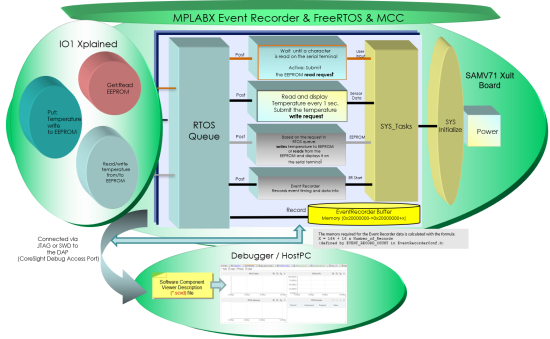
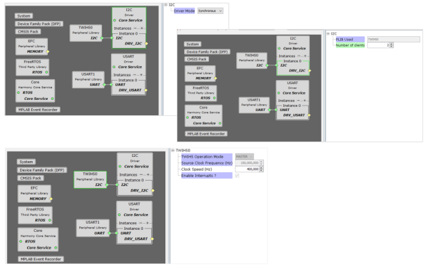
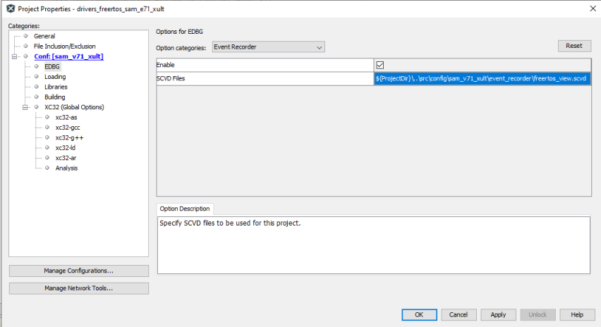

# Event Recorder demonstration application

This readme provides:
1. A description of the example showing how to do event monitoring of an FreeRTOS application. The example project was created using MCC Harmony for SAMV71 XULT.
2. Instructions on how to use MCC Harmony to create and configure your own project to enable you to view and analyze events in MPLAB X.

## Event recorder system
Capturing events helps to understand and analyze the dynamic behavior of software components with little memory overhead. Performance profiling timing of the code execution can be viewed and saved for future analysis. The Event Recorder library enables buffering of data in local memory. The debugger reads the data over SWD and MPLAB X lets you list and display the captured data. The Event Recorder system ensure fast recording with mininmal footprint of events without specific trace requirements.

## Example application description
The event recorder example application configures a SAM V71 Xplained Ultra development board with a ATIO1-XPRO - I/O1 Light and Temperature Sensor Expansion Board connected for Xplained Pro Evaluation Platform. The application reads the room temperature using I/O1 Xplained Extension Kit and sends it to a serial console every one second. The temperature readings are written to EEPROM. I/O1 board's LED connected to PA0 is toggled when the temperature is displayed on the serial bus. 

Read/Write from/to the EEPROM is done through the Two-Wire Interface High Speed (TWIHS) (I²C) Synchronous Driver. Universal Synchronous Asynchronous Receiver Transmitter (USART) Synchronous Driver to print the temperature values on a COM (serial) port terminal application running on a PC.
Port PA0 Peripheral Library toggle an LED. FreeRTOS library creates application threads and intercommunicate between application threads.

## Architecture
The event recorder application uses the MPLAB Harmony Configurator to setup the USART, I²C, FreeRTOS, and other items in order to read the temperature values from the sensor and write it EEPROM on the I/O1 Xplained Kit. The size of event recorder buffer is set to be able to handle the rate of captured event data. The Xplained Pro series evaluation kits include an onboard Embedded Debugger (EDBG). For this example, EDBG is used as debugger. No external tool is required to program or debug the ATSAMV71Q21B. For programming/debugging, the EDBG connects to the host PC through the USB Micro-B connector on the SAM V71 Xplained Ultra Evaluation Kit. The following figure shows the architecture for the demonstration.

The following steps shows you how to create an MPLAB Harmony Project configured with Event Recorder from scratch how to configure, and generate. It demonsrates the reading of temperature sensor values from the temperature sensor available on the I/O1 Xplained Pro Extension Kit periodically and displays it on a serial console. It further writes the temperature readings to EEPROM. When a character is entered on the console, the last five written temperature values are read from the EEPROM and displayed on the console. Also, an I/O1 LED connected to PA0 via EXT1 Pin#7 is toggled every time the temperature is displayed on the serial console.

## Features demonstrated
The application functionality is divided into three threads:
* Sensor Thread – Read and display temperature periodically via Two-Wire Interface High Speed (TWIHS) (I²C)
* EEPROM Thread – Write the temperature values to EEPROM and display it on the COM (serial) port terminal when requested by the user.
* User Input Thread – Read the character entered on the COM (serial) port terminal.

All threads are created before starting FreeRTOS schedular (xTaskCreate(...)). Once the scheduler is invoked (vTaskStartSchedular()) the threads start to run based on the default scheduling method (preemptive). By default, the sensor thread is blocked and wakes up every time the temperature sampling period gets expired. Once active, the sensor thread reads the latest room temperature value from the temperature sensor and send it to the serial terminal. It also notifies the EEPROM thread through the RTOS queue of the availability of the latest temperature value which needs to be stored in the EEPROM. Once notified, the sensor threads block again for the temperature sampling period duration. The EEPROM thread is in the waiting state for an event to occur. It wakes up when there is an event in the RTOS queue to either write the latest temperature value or the read last five temperature values. Based on the event, the EEPROM thread performs writing or reading and goes back to the waiting state. By default, the user input thread is blocked to receive a character on the USART receive line. Once a character is received the user input thread becomes active and submits an EEPROM read request to the EEPROM thread through the RTOS queue to read the last five temperature values stored in EEPROM. After serving the user input request, the thread goes back to the blocking state to receive another character on the USART receive line. The implemented features are shown in the block diagram below.

### Architecture Block Diagram

## Implementation Procedure

### Hardware Modification
The temperature sensor has two TWI addresses; one for the temperature sensor and one for the EEPROM. The addresses are "0b1001 A2 A1 A0" for the temperature sensor and "0b1010 A2 A1 A0" for the EEPROM which stated in the I/O1 Xplained Pro user guide. The address selection lines (A2, A1, and A0) of the temperature sensor chip is by default pulled high through 100kΩ resistors, which makes the default addresses 0b1001111 (0x004F) and 0b1010111 (0x0057).
The A2 address line of TWI must be soldered to 0. This is done to modify the address of the EEPROM on the I/O1 Xplained Pro Extension Kit so that it does not conflict with the address of EEPROM on the SAMV71 XULT Evaluation Kit. The modification changes the address of the temperature sensor to 0x4B and EEPROM to 0x50. (#define APP_SENSOR_I2C_SLAVE_ADDR 0x004B in app_sensor_thread.c) and (#define APP_EEPROM_I2C_SLAVE_ADDR 0x0053 in app_eeprom_thread.c). The hardware modification on the IO1 Xplained Pro is shown in the following figure.

## Harmony Project Implementation
The default configuration can be used for most of the app. However, the following configurations must be updated:

* Setup MCC Plugin, create Harmony Project and configure 

* Verify clock settings via

Plugins: > Clock Configuration
The processor clock (HCLK) and master clock are set to 300 MHz and 150 MHz respectively. 

* Add and configure I²C Driver 

Set the driver mode to Synchronous. Click on Instance 0 under I²C Driver and set the number of clients to 2 as we have temperature sensor and EEPROM client interfaces. Keep default configuration for TWIHS0 as our implemented interface can operate at 400 kHz I²C speed. I²C Driver are shown in the following figure:

* Add and configure USART Driver.

Associate USART Driver with USART instance 1 (USART1) peripheral. Verify that the USART driver is set to run in Synchronous mode by clicking on the USART block. Click on Instance 0 under USART Driver to view the Configuration Options. Change the number of clients to the USART driver Instance from 0 to 3. The User Input Thread will use the USART driver to read the character input on the serial terminal. Select the USART1 Peripheral Library in the Project Graph and configure it for USART protocol, including setting the baud rate to 115200 Hz. The USART driver settings are shown in the following figure:

* Configure Pins
Select the Pin Table from drop-down menu and enable pins USART1_TXD1 on PB04 (Pin #105), USART1_RXD1 on PA21 (Pin #32), I²C Clock TWIHS0_TWCK0 on PA04 (Pin #77) and I²C Data TWIHS0_TWD0 on PA03 (Pin #91).

* Configure System and Application Threads as shown in the following figure:

* Set Event Recorder configuration options.

The Event Recorder collects event data, generates time stamps, and transfers this information via a debug unit to a host computer. Click on "MPLAB Event Recorder" and set the configuration options. The Number of Records configures size of Event Record Buffer (each record is 16 bytes) and it can be 2^n (min=8, max=65536). The Time Stamp Source selects the source for 32-bit time stamp source and can be selected as shown in the following table:

| **Time Stamp Source** | **Function** |
| --- | --- |
| 0 | DWT Cycle Counter |
| 1 | SysTick |
| 2 | CMSIS-RTOS2 System Timer |
| 3 | User Timer (Normal Reset) |
| 4 | User Timer (Power-On Reset) |

The Time Stamp Clock Frequency [Hz] defines the initial timer clock frequency. The time stamp clock frequency should be set to target's core clock frequency, i.e. 300 MHz.

* Click on the Generate button to start generating code and check generated templates as shown in the table:

Copy the pre-developed files app_sensor_thread.c, app_sensor_thread.h, app_eeprom_thread.c, app_eeprom_thread.h,  app_user_input_thread.c, and app_user_input_thread.h. Paste and replace the files of your project available at <Your project folder>/..../firmware/src with the copied files. 

Find the source code FreeRTOSConfig.h and modify macro definition configUSE_TRACE_FACILITY to 1, and include the source code EventRecorderRTOSHook.h 

* Connect hardware kit SAMV71 XULT with I/O1 Xplained Pro to computer

* Open project properties dialog and select the debug tool (EDBG in this case)

* Enable the event recorder and specify the path of SCVD file freertos_view.scvd in the debug tool property. You may use either absolute path or use macro ${ProjectDir} for relative path

## Configure and view plots in Event Recorder

* Open Event Recorder from the menu bar Window=> Event Recorder

* In the user interface, click add button to add available plots. In this case there are four plots available: RTOS Tasks, RTOS Memory, RTOS CPU, and RTOS Events they are defined in freertos_view.scvd added to the project

* Every plot can be moved, resized, rotated, zoomed-in, zoomed-out, and closed

* You can organize the plots according to your preference, the time axis is the number of seconds since debug start

* Open the TeraTerm or PuTTY terminal application on your PC and select assigned Serial Port and set baud rate to 115200.

* Rebuild the project and launch a debug session, the plots will be updated continuously, and you should see the temperature values being displayed on the terminal every one second as shown below:

### Save/load events to/from file, and clean events in plots

* Click the Save button to open the dialog box, then specify the path and file name, click OK to save. Note only the data in the existing plots will be saved to the file.

* All the events are saved to a file in XML format, with human readable data

* Click Open button to open dialog, and select the file you want to load events from

