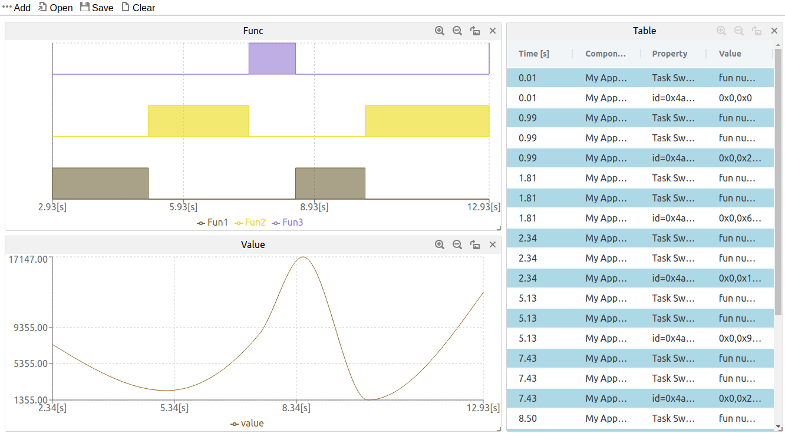

# Event Recorder demo application
This demo application provides an example of tracing functions and variables using the Event Recorder in MPLABX. The project is configured for SAME54 Curiosity Ultra by MCC Harmony.

## Debug Tool
The SAME54 Curiosity Ultra kit includes an onboard Embedded Debugger (EDBG). This example utilizes the Edbg tool.

## Compiler
The XC32 Compiler is used.

## Harmony modules used in the example
1. Core
2. CMSIS Pack
3. Device Family Pack (DFP)
4. System
5. EVSYS
6. NVMCTRL
7. MPLAB Event Recorder

## Preparing to track a function
To track a function, you need to know the function ID and function name. To minimize footprint and improve performance, IDs are used in the firmware instead of string names. The IDs are translated into full name on the PC side. The following code sends an array where the first 4 bytes represent the function ID, followed by the function name. The value 0x4A01 is the agreed-upon identifier between the firmware and MPLABX. It indicates the creation of an function.

In the firmware's main.c file, you will find the following code:
```
void CreateFunction(char* name, int id) {
    size_t length = strlen(name);
    char data[length + 4];
    memcpy(data, &id, 4);
    memcpy(&data[4], name, length);
    EventRecordData(0x4A01 + EventLevelOp, data, length + 4);
}
```
In the SCVD file for MPLABX, you will find the corresponding code:
```
<create id="0x4A01" tid_format="%x[val1]" tname_format="%t[val2]%t[val3]%t[val4]"/>
```

## Delaying
The delay function is used in this example to mimic the application's activity, while the cycle counter is employed to keep track of the iterations.
```
void delayms(uint32_t ms) {
    uint32_t start, elapsed;
    uint32_t count = ms * (SystemCoreClock / 1000000);

    start = DWT->CYCCNT; //CYCCNT is 32bits, so no wrap problems till over 1 Hour
    while (1) {
        elapsed = DWT->CYCCNT - start;
        if (elapsed >= count)
            return;
    }
}
```

## Tracking a function
To track a function, you need to determine the time points when it starts and ends. The following code sends events to the Event Recorder when a function with ID=1 starts and ends. The values 0x4A02 and 0x4A03 are the agreed-upon identifiers between the firmware and MPLABX. They indicate the start and end of a function, respectively.
```
void Fun1() {
    EventRecord2(0x4A02 + EventLevelOp, 1, 0); // Event at Start

    // do something
    RecordValue();
    delayms(rand() % RAND_MAX * 100);

    EventRecord2(0x4A03 + EventLevelOp, 1, 0); // Event at Finish
}
```
Each function performs the following two tasks:
1. Calls RecordValue() to record a random variable.
2. Delays for a random
You can create Fun2() and Fun3() in the same way.

In the SCVD file for MPLABX, you will find the corresponding code:
```
<task name="Func">
    <create id="0x4A01" tid_format="%x[val1]" tname_format="%t[val2]%t[val3]%t[val4]"/>
    <switch_in id="0x4A02" tid_format="%x[val1]"/>
    <switch_out id="0x4A03" tid_format="%x[val1]"/>
</task>
```

## Tracking CPU usage of functions
To track the percentage of time that the CPU is actively executing a function, you need to refer to the function definition section in the SCVD file.
```
<cpu name="CPU percentage" ref="Func"/>
```
The attribute ref="Func" means that the CPU percentage is calculated by the existing function events defined in the section <task name="Func">.

## Tracking value
To track a value, the firmware and MPLABX agree to use a special event with ID=0x4A04 for updating a value. The first 4 bytes are not used, and the last 4 bytes represent the value. The following code can be found in the firmware, where the value is generated randomly.

```
void RecordValue() {
    EventRecord2(0x4A04 + EventLevelOp, 0, rand() % RAND_MAX);
}
```
The corresponding content in the SCVD file is as follows:
```
<update id="0x4A04" variable="value" expr="%d[val2]"/>
```

## Starting the Event Recorder
The Event recorder must be initialized. This is done with the following code at the beginning of void SYS_Initialize(...):
```
EventRecorderInitialize(EventRecordAll, 1);
```

## Running the functions
In addition to SYS_Initialize(...) and CreateFunction(...) in the main function, a while loop is used to sequentially execute three functions.
```
int main(void) {
    /* Initialize all modules */
    SYS_Initialize(NULL);

    CreateFunction("Fun1", 1);
    CreateFunction("Fun2", 2);
    CreateFunction("Fun3", 3);

    while (1) {
        Fun1();
        Fun2();
        Fun3();
    }

    /* Execution should not come here during normal operation */

    return ( EXIT_FAILURE);
}
```
## Observing the functions and the value
To observe the functions and the recorded values:
1. Open the Event Recorder.
2. Add "Func", "Value", and "Table" window to the event recorder.
3. Observe the function execution and the random value in the Event Recorder.
4. In the "Table" window, you can view the detailed events received by MPLAB.


