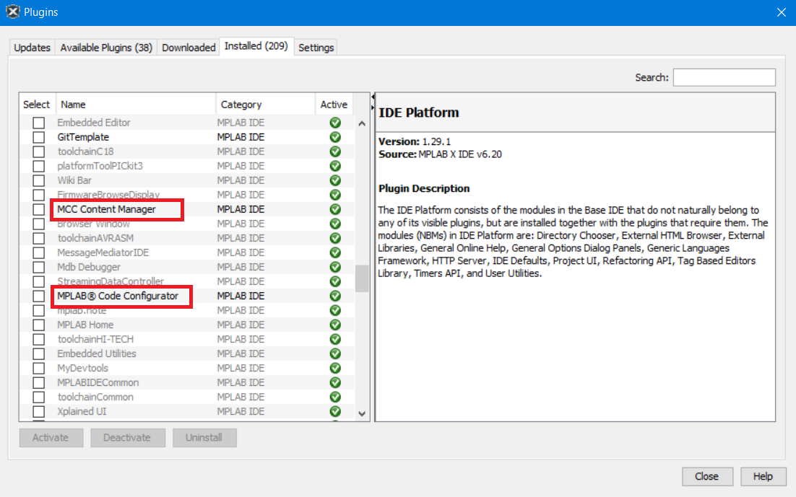
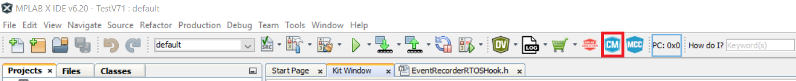
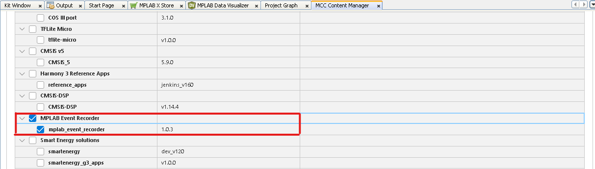
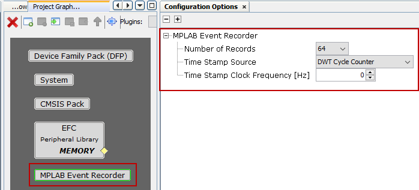
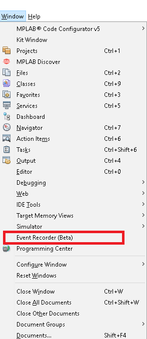
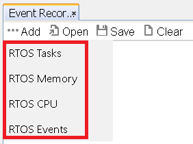
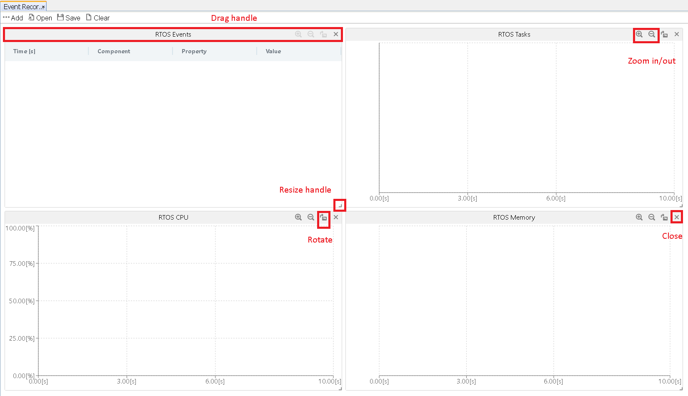
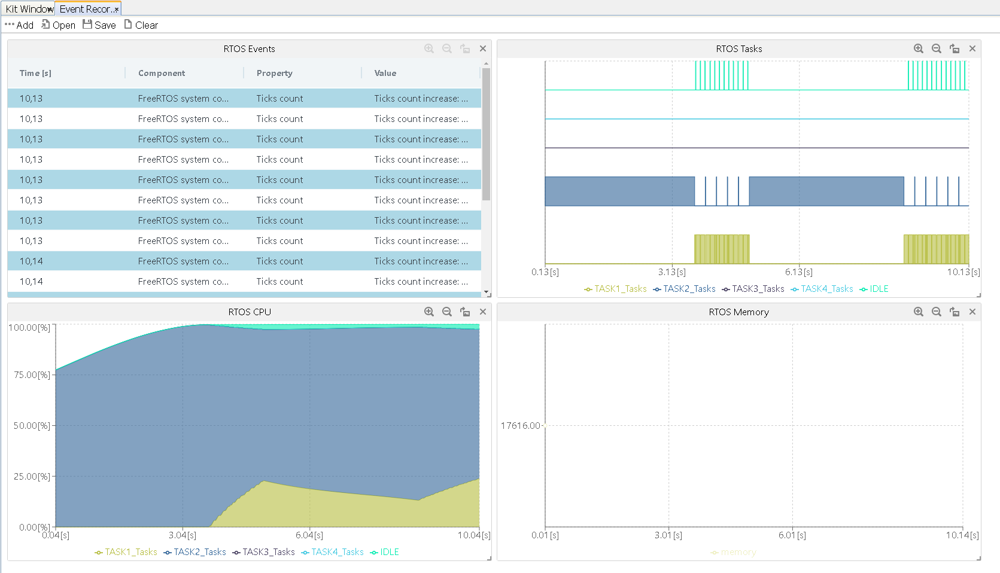

# MPLAB® Event Recorder

- [About Event Recorder](#section-0)
- [Get started with Event Recorder](#section-1)
  - [Installation](#section-1.1)
  - [configuration](#section-1.2)
- [How to use SCVD file](#section-2)


<a id="section-0"></a>

## About Event Recorder

MPLAB® Event Recorder utilizes the MCU's memory to store event notifications and transmit them via SWD. It is compatible with Cortex-M devices.

MPLAB X has the capability to present the event log and transform the information into a more easily understandable format.

The formatting of event IDs and event data is determined by the SCVD file.

You can generate custom IDs and specify the formatting of the data. By utilizing the provided SCVD files and FreeRTOS event hooks, you can swiftly establish event capturing.

The event view provides a graphical representation of tasks, CPU usage, and memory usage. This feature is valuable for identifying problematic areas and serves as a useful tool during development.

<a id="section-1"></a>

## Get started with Event Recorder

<a id="section-1.1"></a>

## Installation

1. Download and install MPLABX
2. MCC plugins are installed by MPLABX installer by default. To confirm:
    - Navigate to Tools menu in MPLAB
    - Locate the plugin option
    - check MCC Content Manager and MPLAB Code Configurator are installed

    

3. Download Mplab Event Recorder package from MCC Content Manager.

    3.1 Open MCC Content Manager 
    
    

    3.2 Download Mplab Event Recorder package from Content manager

    

<a id="section-1.2"></a>

## Configuration

1. To customize the configuration options of the Event Recorder, you can utilize the Mplab Code Configurator (MCC) plugin.

    

    Then press on generate source code button and you will see in the tree project the event Recorder configuration files added.

2. Create the scvd file

    The SCVD file defines the function calls and the plots that will use event group to decode the event data to human readable text.
    To have a better overview on how to use the scvd file please check the section [How to use Event Recorder.](#section-2)

3. Configure the plots

    Access the MPLAB Event Recorder through the Window Menu.

      

    Select the plots to add from the drop-down list. This list is populated based on the plots specified in the scvd file.

      

    The layout of plots offers various customization options to enhance the user experience. You manipulate the plots by resize, drag and drop, zoom in/out and rotate. By using these features, you can personlize the arrangement and appearance of plots as wanted.

      

    Once you have configured the necessary settings, you are ready to begin visualize data. By starting a debug session, you can observe the continous population of information.

      

    The user has the option to save a snapshot of the analyzed data to a file, allowing for future reference. This snapshot can be loaded whenever needed. Additionnaly, the user can clear the plots to remove the displayed data.


<a id="section-2"></a>

## How to use the SCVD file

SCVD file is used to convert received values in event recorder to human readable information. The file is in XML format, and it's compatible with ARM SCVD file with very tiny difference. Due to the time limit, only part of corresponding SCVD features in ARM are implemented in MPLABX.
Example SCVD file:
```xml
<?xml version="1.0" encoding="utf-8"?>
<component_viewer schemaVersion="0.1" xmlns:xs="http://www.w3.org/2001/XMLSchema-instance" xs:noNamespaceSchemaLocation="Component_Viewer.xsd">
    <component name="MyExample" version="1.0.0"/>    <!-- name and version of the component  -->
    <events>
      <group name="My Events Group">
         <component name="MyApp"      brief="My Application"    no="0x4A" prefix="EvrNetMM_"    info="Network - System - Dynamic Memory Management"/>
      </group> 
  
      <event id="0x4A01" level="API"   property="MyFunctionAPI"     value="parameter=%x[val1]"     info="Event on start of MyFunction"  />
      <event id="0x4A02" level="Error" property="MyFunctionError"   value="error=%x[val1]"         info="Event on error in MyFunction" />
      <event id="0x4A03" level="Op"    property="MyFunctionProcess" value="string=%t[val1]"        info="Event on operation in MyFunction"  />
    </events>
    <plots>
      <task name="Task">
        <create id="0x4A01" tid_format="%x[val1]" tname_format="%t[val2]%t[val3]%t[val4]"/>
        <switch_in id="0x4A02" tid_format="%x[val1]"/>
        <switch_out id="0x4A03" tid_format="%x[val1]"/>
      </task>
      <cpu name="Percent" ref="Task"/>
      <line name="Value">
        <update id="0x4A04" variable="value" expr="%d[val1]"/>
      </line>
      <table name="All Events" ref="My Events Group"/>
    </plots>
</component_viewer>
```
### 1. component_viewer

|Parent Element|Element Chain|||
|----|----|----|----|
|Root|document root|||
|**Attributes**|**Description**|**Type**|**Use**|
|xmlns:xs|Specifies the underlying XML schema to which the SCVD schema is compliant. Has to be set to: "http://www.w3.org/2001/XMLSchema-instance"|xs:decimal|required|
|xs:noNamespaceSchemaLocation|Specifies the file name of the SCVD Schema: "Component_Viewer.xsd"|xs:string|optional|
|schemaVersion|Specifies the compliant SCVD schema version (for example, "1.1")|xs:string|optional|
|**Child Elements**|**Description**|**Type**|**Occurence**|
|component|Name of component and version of this SCVD file|Components Type|0..1|
|events|Group element for one or more event elements|Events Type|0..1|
|plots|Definition of plots in event recorder user interface|Plots Type|0..1|

 ### 1.1 Component_viewer/component


 
|Parent Element|Element Chain|||
|----|----|----|----|
|component_viewer|/component_viewer|||
|**Attributes**|**Description**|**Type**|**Use**|
|name|Alphanumeric string identifying the component. Used as menu entry to open viewers.|xs:string|required|
|version|Alphanumeric string identifying the version of the component description|xs:string|optional|

### 1.2 Component_viewer/events

|Parent Element|Element Chain|||
|----|----|----|----|
|component_viewer|/component_viewer|||
|**Child Element**|**Description**|**Type**|**Occurrence**|
|event|Define an event|EventType|0..*|
|group|Create an event group|GroupType|0..*|

### 1.2.1 /Component_viewer/events/event

|Parent Element|Element Chain|||
|----|----|----|----|
|events|/component_viewer/events|||
|**Attributes**|**Description**|**Type**|**Use**|
|id|16-bit event id (message and component number) value|xs:string|required|
|level|Event severance level (OP, API, Error, Detail) used for filtering|xs:string|required|
|property|Shown in the Event Property column of the Event Recorder Table view|xs:string|required|
|value|Shown in the Value column of the Event Recorder Table view|xs:string|optional|
|info|Descriptive text with additional information (comment)|xs:string|optional|

### 1.2.2 /Component_viewer/events/group

|Parent Element|Element Chain|||
|----|----|----|----|
|events|/component_viewer/events|||
|**Attributes**|**Description**|**Type**|**Use**|
|name|Define the name of a group. This name is used for filtering.|xs:string|required|
|**Child Element**|**Description**|**Type**|**Occurence**|
|component|Component within the group|ComponentType|0..*|

### 1.2.2.1 /Component_viewer/events/group/component

|Parent Element|Element Chain|||
|----|----|----|----|
|group|/component_viewer/events/group|||
|**Attributes**|**Description**|**Type**|**Use**|
|name|Descriptive component name|xs:string|required|
|brief|Short component name for display purposes|xs:string|required|
|no|Event id component number (bits 8..15)|xs:string|required|
|prefix|Added to hyperlink in context sensitive help system before the < event name >|xs:string|required|
|info|Descriptive text shown when hovering over the component brief|xs:string|optional|

### 1.3 /Component_viewer/plots

|Parent Element|Element Chain|||
|----|----|----|----|
|component_viewer|/component_viewer|||
|**Child Element**|**Description**|**Type**|**Occurrence**|
|task|Define a task plot for the given tasks|TaskType|0..*|
|cpu|Define a cpu usage plot for the given tasks|CPUType|0..*|
|line|Define a line plot for the given variable|LineType|0..*|
|table|Define a table plot for all generated events|TableType|0..*|

### 1.3.1 /Component_viewer/plots/task

|Parent Element|Element Chain|||
|----|----|----|----|
|plots|/component_viewer/plots|||
|**Attributes**|**Description**|**Type**|**Use**|
|name|The name of the task definition, used as title in UI|xs:string|required|
|**Child Element**|**Description**|**Type**|**Occurrence**|
|create|Define a task plot for the given tasks|TaskCreateType|0..1|
|switch_in|Defines the information of task being switched in|TaskSwitchInType|0..1|
|switch_out|Defines the information of task being switched out|TaskSwitchOutType|0..1|

### 1.3.1.1 /Component_viewer/plots/task/create 

|Parent Element|Element Chain|||
|----|----|----|----|
|task|/component_viewer/plots/task|||
|**Attributes**|**Description**|**Type**|**Use**|
|id|The event id that indicates a task being created|xs:string|required|
|tid_format|The format string used to convert event values to task id|xs:string|required|
|tname_format|The format string used to convert event values to task name|xs:string|required|

### 1.3.1.2 /Component_viewer/plots/task/switch_in

|Parent Element|Element Chain|||
|----|----|----|----|
|task|/component_viewer/plots/task|||
|**Attributes**|**Description**|**Type**|**Use**|
|id|The event id that indicates a task is switched in|xs:string|required|
|tid_format|The format string used to convert values to task id|xs:string|required|

### 1.3.1.3 /Component_viewer/plots/task/switch_out

|Parent Element|Element Chain|||
|----|----|----|----|
|task|/component_viewer/plots/task|||
|**Attributes**|**Description**|**Type**|**Use**|
|id|The event id that indicates a task is switched out|xs:string|required|
|tid_format|The format string used to convert values to task id|xs:string|required|


### 1.3.2 /Component_viewer/plots/cpu

|Parent Element|Element Chain|||
|----|----|----|----|
|plots|/component_viewer/plots|||
|**Attributes**|**Description**|**Type**|**Use**|
|name|The unique name of the plot, used as title in the UI|xs:string|required|
|ref|Refers to the name of task definition, which is defined in section 1.3.1|xs:string|required|


### 1.3.3 /Component_viewer/plots/line

|Parent Element|Element Chain|||
|----|----|----|----|
|plots|/component_viewer/plots|||
|**Attributes**|**Description**|**Type**|**Use**|
|name|The unique name of the line plot, used as title in the UI|xs:string|required|
|**Child Element**|**Description**|**Type**|**Occurrence**|
|update|Defines how a line is updated|UpdateType|0..*|

### 1.3.3.1 /Component_viewer/plots/line/update 

|Parent Element|Element Chain|||
|----|----|----|----|
|line|/component_viewer/plots/line|||
|**Attributes**|**Description**|**Type**|**Use**|
|id|The event id that indicates a line to be updated|xs:string|required|
|variable|The name of the variable for the line|xs:string|required|
|expr|The format string used to convert values to variable|xs:string|required|


### 1.3.4 /Component_viewer/plots/table

|Parent Element|Element Chain|||
|----|----|----|----|
|plots|/component_viewer/plots|||
|**Attributes**|**Description**|**Type**|**Use**|
|name|The unique name of the table, used as title in the UI|xs:string|required|
|ref|Refers to the name of the event group, which is defined in section 1.2.2|xs:string|required|


